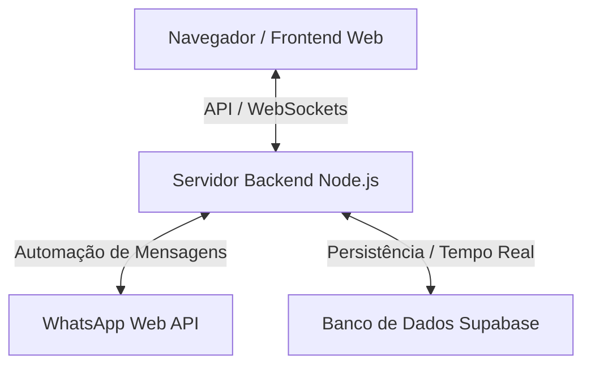

# Sentir Bem - Plataforma de Acolhimento e Gestão Psicológica

O **Sentir Bem** é uma plataforma digital moderna e integrada que atua no ecossistema de saúde mental e bem-estar. O projeto une um site institucional premium voltado para a captação de clientes, um chatbot automatizado para atendimento via WhatsApp, um painel administrativo completo para profissionais de psicologia e integração em tempo real com banco de dados em nuvem.

---

## 📌 O que é e para que serve o projeto?

O projeto serve para **estreitar a ponte entre pacientes e psicólogos**, otimizando o fluxo de acolhimento e agendamentos. 

- **Para o Paciente:** Oferece uma interface web fluida e acolhedora para conhecer os serviços (focados em TCC - Terapia Cognitivo-Comportamental), tirar dúvidas, escolher planos de assinatura e agendar sessões de forma automatizada pelo WhatsApp.
- **Para o Profissional:** Disponibiliza uma área administrativa segura para gerenciar prontuários, horários de consultas, faturamentos, pacientes ativos e configurações gerais da plataforma.
- **Para a Operação:** Centraliza a inteligência de triagem no backend, detectando automaticamente mensagens críticas (como ideações suicidas ou crises de pânico) para dar prioridade ou redirecionamento adequado e seguro.

---

## 🏗️ Arquitetura e Componentes do Sistema

O sistema é dividido em três camadas principais que se conectam em tempo real:



### 1. Frontend Institucional & Área do Cliente
- **`index.html` e `css/style.css`**: Design premium com efeito *glassmorphism* (efeito de vidro fosco), animações fluidas via AOS (*Animate On Scroll*), modo escuro integrado e layout 100% responsivo para celulares e desktops.
- **`js/script.js`**: Lógica de interação do lado do cliente, manipulação de abas de planos, sistema de notificações personalizadas (*toasts*) e comportamento dinâmico do menu mobile.
- **`pages/login.html`**: Portal de acesso seguro para pacientes e profissionais.

### 2. Backend & Inteligência do Chatbot (`chatbot.js`)
- **Servidor Web Express**: Roteia e serve os arquivos do site e o painel administrativo.
- **Integração com WhatsApp Web**: Utiliza a biblioteca `whatsapp-web.js` para autenticar o bot através de QR Code no terminal e gerenciar o envio/recebimento de mensagens em tempo real.
- **Filtro de Segurança & Triagem**: Motor inteligente que analisa o texto das mensagens recebidas e detecta palavras-chave relacionadas a crises de saúde mental, garantindo um tratamento humanizado prioritário.
- **Persistência de Dados**: Sincroniza informações de clientes e agendamentos com o Supabase.

### 3. Painel Administrativo (`/admin`)
- Um dashboard reservado para psicólogos acompanharem métricas de consultas realizadas, controle financeiro, histórico de conversas dos pacientes e status do servidor.

---

## 📂 Estrutura de Diretórios

A estrutura física do projeto reflete a separação estrita de responsabilidades:

```text
sentir-bem/
├── index.html              # Página institucional (Landing Page)
├── chatbot.js              # Servidor backend, API e integração com WhatsApp
├── package.json            # Manifesto do projeto e dependências Node.js
├── .env                    # Variáveis de ambiente e segredos (Supabase, Porta, etc.)
├── admin/                  # Dashboard administrativo do profissional
├── assets/                 # Recursos visuais organizados por seções:
│   ├── chatbot/            # Elementos gráficos da seção do chatbot
│   ├── especialidades/     # Ilustrações dos tipos de atendimento
│   ├── fundos/             # Imagens de background e overlays
│   ├── identidade/         # Logotipos oficiais e favicon
│   ├── pilares/            # Gráficos da seção de pilares do tratamento
│   ├── processo/           # Fluxograma do passo a passo terapêutico
│   └── sobre/              # Fotos e materiais da seção de biografia
├── config/                 # Arquivos JSON de fluxos de conversas e textos do bot
├── css/                    # Folhas de estilo (style.css e bibliotecas de animação)
├── js/                     # Scripts de comportamento web
├── pages/                  # Páginas secundárias (Login, Cadastro)
└── tests/                  # Suíte de testes automatizados do sistema
```

---

## 🛠️ Tecnologias Utilizadas

- **Core Frontend:** HTML5, CSS3 (Vanilla), JavaScript (ES6+).
- **Ambiente de Execução:** Node.js (v18+).
- **Backend Framework:** Express.js.
- **Banco de Dados & BaaS:** Supabase (PostgreSQL & Realtime).
- **Automação de Mensagens:** `whatsapp-web.js`, `qrcode-terminal`.
- **Qualidade & Testes:** Suíte de teste nativa do Node (`node:test`, `node:assert`).

---

## 🚀 Como Executar o Projeto

### Pré-requisitos
Certifique-se de ter o [Node.js](https://nodejs.org/) instalado na versão 18 ou superior.

### 1. Instalação de Dependências
Instale todos os pacotes necessários listados no `package.json`:
```bash
npm install
```

### 2. Configuração de Ambiente
Crie um arquivo `.env` na raiz do projeto contendo as chaves de acesso ao Supabase (consulte o modelo fornecido ou crie um a partir das suas credenciais do projeto):
```env
SUPABASE_URL=sua_url_aqui
SUPABASE_KEY=sua_chave_anonima_aqui
PORT=3000
```

### 3. Executando o Servidor e o Bot
Inicie o servidor principal. O terminal exibirá um QR Code para você escanear com o WhatsApp do seu celular para ativar a sessão do bot:
```bash
npm start
```

### 4. Executando os Testes Automatizados
Para garantir a segurança do sistema de triagem de crise, execute a suíte de testes de sanidade:
```bash
npm test
```

---

## 🔒 Segurança e Boas Práticas
- **Não versionar o `.env`**: Nunca publique suas chaves de API ou segredos. O arquivo `.gitignore` já está configurado para evitar isso.
- **Sessão do Bot**: A pasta `.runtime` gerada na inicialização do bot contém dados da sessão logada no WhatsApp Web e não deve ser exposta ou editada manualmente.
